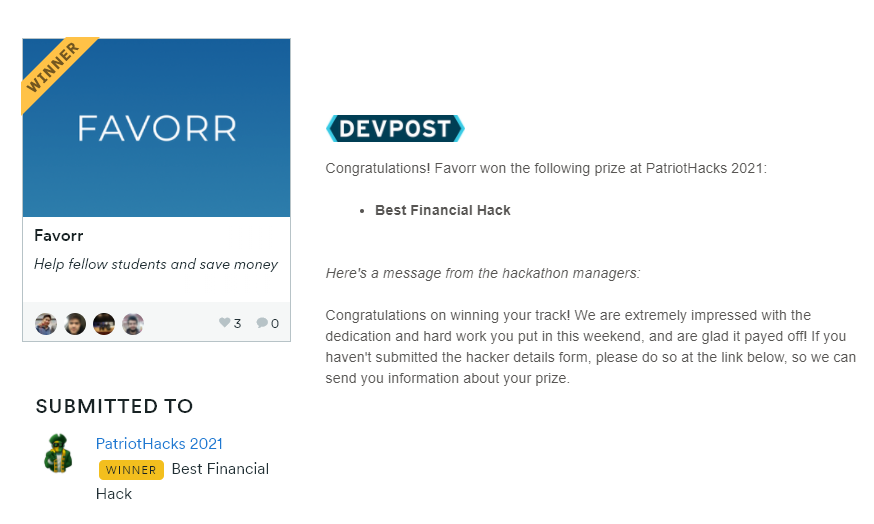

<!-- PROJECT LOGO -->
<br />
<p align="center">
  
  <a href="https://github.com/sahircansurmeli/hackathon-favor-app">
    
  </a>

  <h3 align="center">Favorr</h3>

  <p align="center">
    Share your Path, Save Lives
    <br />
    <a href="https://github.com/sahircansurmeli/hackathon-favor-app"><strong>Explore the docs »</strong></a>
    <br />
    <br />
    <a href="https://www.youtube.com/watch?v=VBx1oW_mMp0">View Demo(Youtube)</a>
    ·
    <a href="https://github.com/sahircansurmeli/hackathon-favor-app/issues">Report Bug</a>
    ·
    <a href="https://github.com/sahircansurmeli/hackathon-favor-app/issues">Request Feature</a>
     ·
    <a href="https://devpost.com/software/favorr">Devpost Link</a>
  
  </p>
</p>

# Favorr
Favorr aims at developing the solidarity of college communities by giving them an incentive to help each other.

<!-- ABOUT THE PROJECT -->
## About The Project


### Inspiration
  
### What it does
It provides a platform that lets students get rewarded for their kindness. Students can complete tasks such as tutoring another student, giving out their old textbooks and more to earn in-app points, which in return they can use for buying such favors again. 

<!-- GETTING STARTED -->
## Getting Started

This is an example of how you may give instructions on setting up your project locally.
To get a local copy up and running follow these simple example steps.

### Prerequisites

* [NodeJS](https://nodejs.org/en/)
* [React Native](https://reactnative.dev/)
* [FireBase](https://firebase.google.com/)
* [Android Studio(For Android Only)](https://developer.android.com/studio?hl=nl)
* Or your phone

### Installation

1. Set up a database for [FireBase](https://firebase.google.com/)
2. Go to Project overview -> Project settings -> Firebase SDK snippet
3. Check "Config" Radiobox, copy paste the firebaseConfig to 
```
firebase-config.json
```
4. Clone the repo
```sh
git clone https://github.com/sahircansurmeli/hackathon-favor-app.git
```
5. Execute the command to get dependancies
```sh
npm install (yarn works too, but we tested only npm)
```
6. Now, start the application by the command
```sh
npm start
```

7. You may use your Expo on your phone or a virtual device machine on Android Studio or iOS machines.

8. You are Ready to Start Locavid! 👍

<!-- ROADMAP -->
## Technologies Used

* [NodeJS](https://nodejs.org/en/)
* [React Native](https://reactnative.dev/)
* [FireBase](https://firebase.google.com/)
* [Figma](https://www.figma.com/)

<!-- ROADMAP -->
## Roadmap

See the [open issues](https://github.com/sahircansurmeli/hackathon-favor-app/) for a list of proposed features (and known issues).


<!-- CONTRIBUTING -->
## Contributing

Contributions are what make the open source community such an amazing place to be learn, inspire, and create. Any contributions you make are **greatly appreciated**.👌

1. Fork the Project
2. Create your Feature Branch (`git checkout -b feature/hackathon-favor-app`)
3. Commit your Changes (`git commit -m 'Add some hackathon-favor-app'`)
4. Push to the Branch (`git push origin feature/hackathon-favor-app`)
5. Open a Pull Request

## DevPost

[Favorr Devpost Link](https://devpost.com/software/Favorr)

You may find more details on our Devpost, too!

Please, show us some love💕 on our Devpost! 

We are also the winner of PartiorHack2021 ! 


<!-- CONTACT -->
## Contact

Sahircan Surmeli [@sahircansurmeli](https://github.com/sahircansurmeli)

Jeong Min Cho [@E2Slayer](https://e2slayer.github.io/) 

Enes Tasbasi [@etasbasi](http://etasbasi.com)

Kaan Turkmen [@sahircansurmeli](https://github.com/turkmenkaan)

<!-- LICENSE -->
## License

Distributed under the MIT License. See `LICENSE` for more information.


